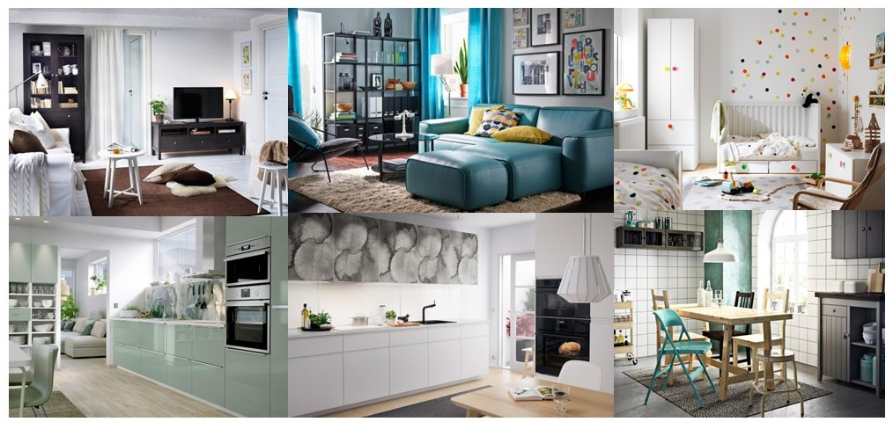
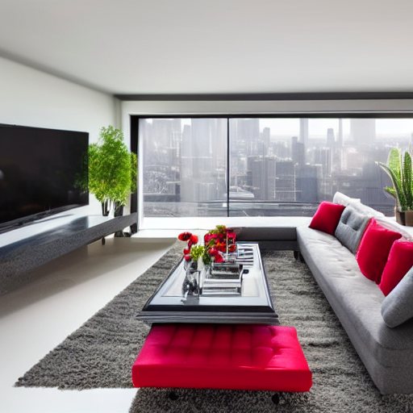
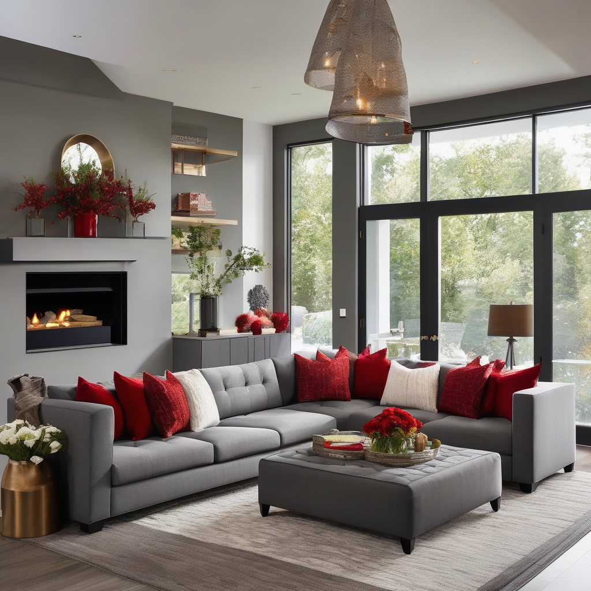

# SDXL-BERT: Enhancing Text-to-Image Generation for Interior Design through Semantic Prompt Optimization

[](https://opensource.org/licenses/MIT)

This repository contains the official implementation of the paper **"SDXL-BERT: Enhancing Text-to-Image Generation for Interior Design through Semantic Prompt optimization"**. We introduce an advanced text-to-image generation pipeline that significantly improves image quality and prompt alignment for interior design applications.

---

###  Live Demo

Experience the power of SDXL-BERT firsthand! You can try out a live simulation of the project on our website:

**[➡️ Launch the Web Simulator](https://silly-basbousa-3dc2ee.netlify.app/)**

---


##  Project Overview 

The interior design industry demands high-quality, contextually accurate visualizations. Traditional text-to-image models often struggle with complex, descriptive prompts, leading to generated images that lack detail or fail to capture the user's intent.

SDXL-BERT addresses this challenge by integrating powerful language models to refine and enrich user prompts before they are fed into the image generation model (SDXL). Our pipeline semantically analyzes, summarizes, and weights the prompt to produce images that are more coherent, detailed, and aesthetically pleasing. This approach significantly narrows the gap between user imagination and AI-generated reality for interior design concepts.

##  Key Features

* **Semantic Prompt Enhancement**: Utilizes **Flan-T5-base** for summarizing long prompts and **BERT-base** to analyze and assign semantic weights to key terms.
* **High-Fidelity Image Generation**: Leverages the power of **Stable Diffusion XL (SDXL)** for generating high-resolution (1024x1024) images.
* **Optimized Generation Speed**: Implements **Latent Consistency Model (LCM)** refinement for faster inference without compromising quality.
* **Superior Performance**: Outperforms the baseline SDXL model in standard image quality metrics (CLIP, LPIPS, SSIM).
* **Domain-Specific Focus**: Specifically tailored and evaluated for the nuances and complexities of interior design prompts.

##  Dataset

This project utilizes a specialized and enhanced version of the IKEA dataset to effectively train and evaluate the model on interior design prompts. The dataset has been carefully curated and processed to provide rich, descriptive captions.

### Dataset Specifications
* **Total Images**: 10,000+
* **Caption Length**: 50-200 words
* **Room Types**: 15+ categories
* **Furniture Items**: 500+ unique items
* **Style Variations**: Modern, Classic, Minimalist, and more.

### Caption Enhancement Process
The text prompts associated with the images were not simple labels. They underwent a rigorous enhancement process to ensure they were descriptive and complex enough to test the limits of text-to-image models.
1.  **Base Description**: An initial caption was generated for each image using the CLIP Interrogator to get a foundational understanding of the scene.
2.  **Domain Refinement**: These base captions were then programmatically enhanced with specific interior design terminology, color theory, and descriptions of spatial relationships.
3.  **Complexity Variation**: To test the model's handling of different levels of detail, captions of varying lengths and complexity were created for the images.

---

##  Architecture

Our pipeline processes a user's text prompt through several stages to generate the final, optimized image. The core components are the Prompt Enhancement Module (BERT and T5) and the Image Generation Module (SDXL and LCM).

.jpg)


1.  **Initial Prompt**: The user provides a descriptive text prompt.
2.  **Prompt Summarization (Flan-T5)**: The prompt is condensed to its core concepts.
3.  **Semantic Weighting (BERT)**: Key terms are identified, and their importance is quantified.
4.  **Optimized Prompt**: The refined and weighted prompt is created.
5.  **Image Generation (SDXL)**: The optimized prompt is used to generate a latent image.
6.  **Refinement (LCM)**: The latent image is refined for quality and fast generation.
7.  **Final Image**: The high-quality interior design image is produced.

---

##  Results

Our model demonstrates significant improvements over the baseline SDXL across both qualitative and quantitative evaluations.

### Qualitative Comparison

Here you can see a side-by-side comparison of images generated by the standard SDXL model versus our enhanced SDXL-BERT pipeline.

| Prompt | Baseline SDXL Output | Our SDXL-BERT Output |
| :--- | :---: | :---: |
| "A cozy living room with a brick fireplace, a plush sectional sofa, and large windows overlooking a snowy landscape." |  |  |
| "A minimalist kitchen with white marble countertops, dark wood cabinets, and stainless steel appliances, illuminated by pendant lights." | .jpg) | .png) |


### Quantitative Metrics

Our model consistently achieves better scores on key image-generation metrics.

| Model | Average CLIP Score | Average LPIPS | Average SSIM |
| :--- | :---: | :---: | :---: |
| Baseline SDXL | 0.5632 | 0.64 | 0.21 |
| **SDXL-BERT (Ours)** | **0.6912** | **0.50** | **0.32** |


---

## 💻 Getting Started

Follow these instructions to set up and run the project on your local machine.

### Prerequisites

- Python 3.8+
- PyTorch
- CUDA-enabled GPU (recommended for performance)

### Installation

1.  **Clone the repository:**
    ```bash
    git clone [https://github.com/YOUR_USERNAME/YOUR_REPOSITORY.git](https://github.com/YOUR_USERNAME/YOUR_REPOSITORY.git)
    cd YOUR_REPOSITORY
    ```


---

## 🔮 Future Work

As detailed in our paper, future enhancements for this project could include:
* **Support for Multimodal Inputs**: Allowing users to provide reference images alongside text prompts.
* **Real-time Interactive Generation**: Optimizing the pipeline for live, interactive design sessions.
* **Domain Adaptation**: Fine-tuning the model on specialized architectural or style datasets.
* **AR/VR Integration**: Exploring capabilities to project generated designs into real-world spaces using augmented or virtual reality.

---


## 📄 License

This project is licensed under the MIT License. See the [LICENSE](LICENSE) file for details.
